# 📊 Fase 3-B: Modelado de Datos y Clases (Python POO)

> **Proyecto:** CRUD Didáctico con Supabase  
> **Fecha:** 2025-12-23  
> **Referencia:** Continuación de `03_a_3_stateless.md`  
> **Stack:** Python POO (sin frameworks)

---

## 1. Modelo de Datos Lógico (DER)

### 1.1 Diagrama Entidad-Relación

```
┌─────────────────────────────────────────────────────────────────────────┐
│                    DIAGRAMA ENTIDAD-RELACIÓN (DER)                      │
└─────────────────────────────────────────────────────────────────────────┘

    ┌───────────────────────────┐         ┌───────────────────────────┐
    │       auth.users          │         │          notas            │
    │   (Supabase - Sistema)    │         │     (Aplicación)          │
    ├───────────────────────────┤         ├───────────────────────────┤
    │ «PK» id         : UUID    │◄───────┐│ «PK» id         : UUID    │
    │      email      : VARCHAR │    1:N ││ «FK» user_id    : UUID    │
    │      password   : VARCHAR │        │├───────────────────────────┤
    │      created_at : TIMESTAMP        ││      title      : TEXT    │
    └───────────────────────────┘        ││      content    : TEXT    │
                                         ││      created_at : TIMESTAMP
                                         ││      updated_at : TIMESTAMP
                                         │└───────────────────────────┘
                                         │
                                         └─── Un usuario tiene 0..N notas
                                              Una nota pertenece a 1 usuario
```

### 1.2 Diccionario de Datos

#### Entidad: `notas`

| Atributo | Tipo | PK/FK | NULL | Default | Descripción |
|----------|------|-------|------|---------|-------------|
| `id` | UUID | PK | NO | `gen_random_uuid()` | Identificador único |
| `user_id` | UUID | FK | NO | - | Referencia a `auth.users(id)` |
| `title` | TEXT | - | NO | - | Título de la nota |
| `content` | TEXT | - | SÍ | NULL | Contenido opcional |
| `created_at` | TIMESTAMPTZ | - | NO | `now()` | Fecha de creación (UTC) |
| `updated_at` | TIMESTAMPTZ | - | NO | `now()` | Última modificación (UTC) |

---

## 2. Diagrama de Clases (Python POO)

El siguiente diagrama refleja los **patrones definidos en Fase 3-A**:
- **Singleton:** `SupabaseClient`, `Settings`, `SessionManager`
- **Adapter:** `AuthService`, `NotasService`
- **Strategy:** `IAuthStrategy`, `EmailPasswordStrategy`

### 2.1 Diagrama Mermaid

```mermaid
classDiagram
    direction TB
    
    %% â•â•â•â•â•â•â•â•â•â•â•â•â•â•â•â•â•â•â•â•â•â•â•â•â•â•â•â•â•â•â•â•â•â•â•â•â•â•â•â•â•â•â•â•
    %% CAPA DE CONFIGURACIÓN
    %% â•â•â•â•â•â•â•â•â•â•â•â•â•â•â•â•â•â•â•â•â•â•â•â•â•â•â•â•â•â•â•â•â•â•â•â•â•â•â•â•â•â•â•â•
    
    class Settings {
        <<Singleton>>
        -_instance: Settings
        +supabase_url: str
        +supabase_key: str
        +__new__() Settings
        -_load_env() void
    }
    
    %% â•â•â•â•â•â•â•â•â•â•â•â•â•â•â•â•â•â•â•â•â•â•â•â•â•â•â•â•â•â•â•â•â•â•â•â•â•â•â•â•â•â•â•â•
    %% CAPA DE INFRAESTRUCTURA - Singleton
    %% â•â•â•â•â•â•â•â•â•â•â•â•â•â•â•â•â•â•â•â•â•â•â•â•â•â•â•â•â•â•â•â•â•â•â•â•â•â•â•â•â•â•â•â•
    
    class SupabaseClient {
        <<Singleton>>
        -_instance: SupabaseClient
        +client: Client
        +__new__() SupabaseClient
        -_initialize() void
    }
    
    %% â•â•â•â•â•â•â•â•â•â•â•â•â•â•â•â•â•â•â•â•â•â•â•â•â•â•â•â•â•â•â•â•â•â•â•â•â•â•â•â•â•â•â•â•
    %% CAPA DE DOMINIO - Entidades
    %% â•â•â•â•â•â•â•â•â•â•â•â•â•â•â•â•â•â•â•â•â•â•â•â•â•â•â•â•â•â•â•â•â•â•â•â•â•â•â•â•â•â•â•â•
    
    class User {
        <<Entity>>
        +id: str
        +email: str
        +created_at: datetime
        +__init__(id, email, created_at)
        +__str__() str
        +to_dict() dict
        +from_dict(data) User
    }
    
    class Nota {
        <<Entity>>
        +id: str
        +user_id: str
        +title: str
        +content: str
        +created_at: datetime
        +updated_at: datetime
        +__init__(id, user_id, title, content, ...)
        +__str__() str
        +to_dict() dict
        +from_dict(data) Nota
    }
    
    %% â•â•â•â•â•â•â•â•â•â•â•â•â•â•â•â•â•â•â•â•â•â•â•â•â•â•â•â•â•â•â•â•â•â•â•â•â•â•â•â•â•â•â•â•
    %% CAPA DE APLICACIÓN - Strategy Pattern
    %% â•â•â•â•â•â•â•â•â•â•â•â•â•â•â•â•â•â•â•â•â•â•â•â•â•â•â•â•â•â•â•â•â•â•â•â•â•â•â•â•â•â•â•â•
    
    class IAuthStrategy {
        <<ABC / Interface>>
        +login(email, password)* dict
        +register(email, password)* dict
        +logout()* void
    }
    
    class EmailPasswordStrategy {
        <<Strategy>>
        -client: SupabaseClient
        +__init__()
        +login(email, password) dict
        +register(email, password) dict
        +logout() void
    }
    
    %% â•â•â•â•â•â•â•â•â•â•â•â•â•â•â•â•â•â•â•â•â•â•â•â•â•â•â•â•â•â•â•â•â•â•â•â•â•â•â•â•â•â•â•â•
    %% CAPA DE APLICACIÓN - Services (Adapters)
    %% â•â•â•â•â•â•â•â•â•â•â•â•â•â•â•â•â•â•â•â•â•â•â•â•â•â•â•â•â•â•â•â•â•â•â•â•â•â•â•â•â•â•â•â•
    
    class AuthService {
        <<Adapter>>
        -strategy: IAuthStrategy
        -session: SessionManager
        +__init__(strategy)
        +login(email, password) User
        +register(email, password) User
        +logout() void
        +is_authenticated() bool
    }
    
    class NotasService {
        <<Adapter>>
        -client: SupabaseClient
        -session: SessionManager
        +__init__()
        +listar() list~Nota~
        +obtener(id) Nota
        +crear(titulo, contenido) Nota
        +actualizar(id, titulo, contenido) Nota
        +eliminar(id) bool
    }
    
    class SessionManager {
        <<Singleton>>
        -_instance: SessionManager
        +current_user: User
        +access_token: str
        +__new__() SessionManager
        +set_session(user, token) void
        +clear() void
        +is_authenticated() bool
        +get_user_id() str
        +require_auth() void
    }
    
    %% â•â•â•â•â•â•â•â•â•â•â•â•â•â•â•â•â•â•â•â•â•â•â•â•â•â•â•â•â•â•â•â•â•â•â•â•â•â•â•â•â•â•â•â•
    %% CAPA DE PRESENTACIÓN - UI
    %% â•â•â•â•â•â•â•â•â•â•â•â•â•â•â•â•â•â•â•â•â•â•â•â•â•â•â•â•â•â•â•â•â•â•â•â•â•â•â•â•â•â•â•â•
    
    class Menu {
        <<Controller>>
        -auth_service: AuthService
        -notas_service: NotasService
        +__init__()
        +run() void
        -mostrar_menu_principal() void
        -mostrar_menu_notas() void
        -manejar_login() void
        -manejar_registro() void
    }
    
    %% â•â•â•â•â•â•â•â•â•â•â•â•â•â•â•â•â•â•â•â•â•â•â•â•â•â•â•â•â•â•â•â•â•â•â•â•â•â•â•â•â•â•â•â•
    %% RELACIONES
    %% â•â•â•â•â•â•â•â•â•â•â•â•â•â•â•â•â•â•â•â•â•â•â•â•â•â•â•â•â•â•â•â•â•â•â•â•â•â•â•â•â•â•â•â•
    
    %% Singleton usa Settings
    SupabaseClient --> Settings : uses
    
    %% Strategy implementa interfaz
    IAuthStrategy <|.. EmailPasswordStrategy : implements
    
    %% Services usan Singleton
    AuthService --> IAuthStrategy : uses
    AuthService --> SessionManager : uses
    NotasService --> SupabaseClient : uses
    NotasService --> SessionManager : uses
    EmailPasswordStrategy --> SupabaseClient : uses
    
    %% Services devuelven entidades
    AuthService ..> User : returns
    NotasService ..> Nota : returns
    
    %% Menu usa services
    Menu --> AuthService : uses
    Menu --> NotasService : uses
    
    %% Relación de dominio
    User "1" --> "0..*" Nota : owns
```



### 2.2 Mapeo Patrón → Clase

| Patrón (Fase 3-A) | Clase Python | Responsabilidad |
|-------------------|--------------|-----------------|
| **Singleton** | `SupabaseClient` | Única instancia del cliente |
| **Singleton** | `Settings` | Configuración desde .env |
| **Singleton** | `SessionManager` | Estado de sesión actual |
| **Strategy** | `IAuthStrategy` | Interfaz de autenticación |
| **Strategy** | `EmailPasswordStrategy` | Implementación email/password |
| **Adapter** | `AuthService` | Encapsula autenticación |
| **Adapter** | `NotasService` | Encapsula CRUD de notas |

---

## 3. Clases de Dominio (Entidades)

### 3.1 Clase User

```python
# src/models/user.py

from dataclasses import dataclass
from datetime import datetime
from typing import Optional

@dataclass
class User:
    """
    Entidad que representa un usuario autenticado.
    
    POR QUÉ dataclass: Reduce boilerplate, genera __init__, __repr__, etc.
    """
    id: str
    email: str
    created_at: Optional[datetime] = None
    
    @classmethod
    def from_dict(cls, data: dict) -> 'User':
        """Factory method para crear User desde diccionario de Supabase"""
        return cls(
            id=data.get('id'),
            email=data.get('email'),
            created_at=data.get('created_at')
        )
    
    def to_dict(self) -> dict:
        """Convierte User a diccionario"""
        return {
            'id': self.id,
            'email': self.email,
            'created_at': str(self.created_at) if self.created_at else None
        }
```

### 3.2 Clase Nota

```python
# src/models/nota.py

from dataclasses import dataclass
from datetime import datetime
from typing import Optional

@dataclass
class Nota:
    """
    Entidad que representa una nota del usuario.
    
    POR QUÉ atributos tipados: Claridad, autocompletado en IDE,
    detección temprana de errores.
    """
    id: str
    user_id: str
    title: str
    content: Optional[str] = None
    created_at: Optional[datetime] = None
    updated_at: Optional[datetime] = None
    
    @classmethod
    def from_dict(cls, data: dict) -> 'Nota':
        """Factory method para crear Nota desde diccionario de Supabase"""
        return cls(
            id=data.get('id'),
            user_id=data.get('user_id'),
            title=data.get('title'),
            content=data.get('content'),
            created_at=data.get('created_at'),
            updated_at=data.get('updated_at')
        )
    
    def to_dict(self) -> dict:
        """Convierte Nota a diccionario (para enviar a Supabase)"""
        return {
            'user_id': self.user_id,
            'title': self.title,
            'content': self.content
        }
    
    def __str__(self) -> str:
        """Representación legible de la nota"""
        return f"[{self.id[:8]}] {self.title}"
```

---

## 4. Flujo de Datos

```
┌──────────────────────────────────────────────────────────────────────┐
│                        FLUJO DE DATOS                                │
├──────────────────────────────────────────────────────────────────────┤
│                                                                      │
│  CREAR NOTA:                                                         │
│  Menu ──► NotasService.crear() ──► SupabaseClient ──► Supabase      │
│      ◄── Nota object ◄─────────── dict response ◄───── INSERT       │
│                                                                      │
│  LISTAR NOTAS:                                                       │
│  Menu ──► NotasService.listar() ──► SupabaseClient ──► Supabase     │
│      ◄── list[Nota] ◄────────────── list[dict] ◄────── SELECT+RLS  │
│                                                                      │
│  LOGIN:                                                              │
│  Menu ──► AuthService.login() ──► Strategy ──► Supabase Auth        │
│      ◄── User object ◄───────── SessionManager.set_session()        │
│                                                                      │
└──────────────────────────────────────────────────────────────────────┘
```

---

## 5. Próximos Pasos

1. ✅ **Fase 3-A Completada:** Arquitectura y Patrones
2. ✅ **Fase 3-B Completada:** Modelado de Datos
3. 🔜 **Fase 3-C Pendiente:** API y Dinámica

---

> **Documento generado:** 2025-12-23
