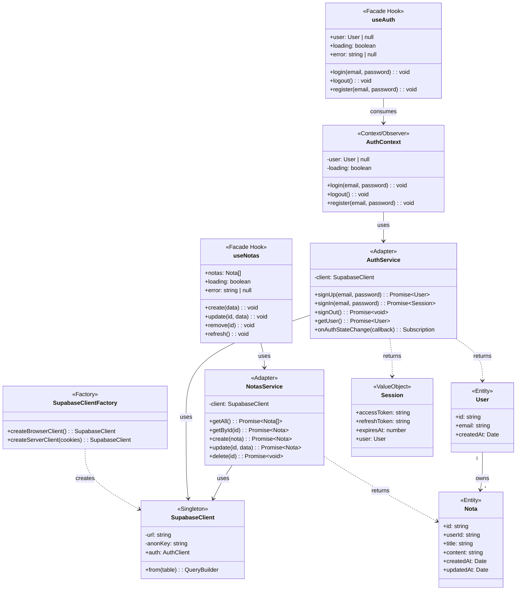
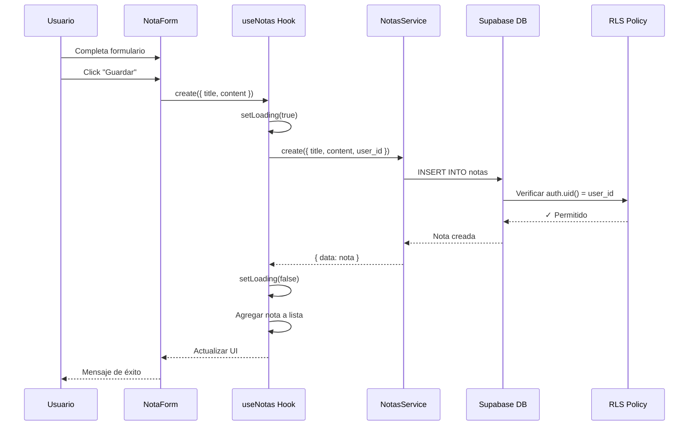

# 📊 Fase 3-B: Modelado de Datos y Clases

> **Proyecto:** CRUD Didáctico con Supabase  
> **Fecha:** 2025-12-23  
> **Referencia:** Continuación de `03_a_3_stateless.md`

---

## 1. Modelo de Datos Lógico (DER)

### 1.1 Diagrama Entidad-Relación

```
┌─────────────────────────────────────────────────────────────────────────┐
│                    DIAGRAMA ENTIDAD-RELACIÓN                            │
└─────────────────────────────────────────────────────────────────────────┘

    ┌───────────────────────────┐         ┌───────────────────────────┐
    │       auth.users          │         │          notas            │
    │ (Tabla de Supabase Auth)  │         │  (Tabla del aplicativo)   │
    ├───────────────────────────┤         ├───────────────────────────┤
    │ PK  id: uuid              │────┐    │ PK  id: uuid              │
    │     email: varchar        │    │    │ FK  user_id: uuid ────────┤
    │     encrypted_password    │    │    │     title: text           │
    │     created_at: timestamptz    │    │     content: text         │
    │     ...                   │    │    │     created_at: timestamptz
    └───────────────────────────┘    │    │     updated_at: timestamptz
                                     │    └───────────────────────────┘
                                     │                │
                                     │                │
                                     └────────────────┘
                                           1:N
                                     Un usuario tiene
                                     muchas notas

CARDINALIDAD:
─────────────
• auth.users (1) ──────► notas (N)
• Un usuario puede tener 0 o más notas
• Una nota pertenece a exactamente 1 usuario
```

### 1.2 Diccionario de Datos

#### Tabla: `notas`

| Campo | Tipo | Restricciones | Descripción |
|-------|------|---------------|-------------|
| `id` | `uuid` | PK, NOT NULL, DEFAULT gen_random_uuid() | Identificador único |
| `user_id` | `uuid` | FK → auth.users(id), NOT NULL, ON DELETE CASCADE | Propietario de la nota |
| `title` | `text` | NOT NULL | Título de la nota |
| `content` | `text` | NULL permitido | Contenido/cuerpo de la nota |
| `created_at` | `timestamptz` | NOT NULL, DEFAULT now() | Fecha de creación |
| `updated_at` | `timestamptz` | NOT NULL, DEFAULT now() | Última modificación |

#### Tabla: `auth.users` (Gestionada por Supabase)

| Campo | Tipo | Descripción |
|-------|------|-------------|
| `id` | `uuid` | Identificador único del usuario |
| `email` | `varchar` | Email del usuario |
| `encrypted_password` | `varchar` | Contraseña hasheada |
| `created_at` | `timestamptz` | Fecha de registro |

---

## 2. SQL DDL (Data Definition Language)

```sql
-- ============================================
-- SCRIPT DE CREACIÓN: Tabla notas
-- Proyecto: CRUD Didáctico con Supabase
-- Fecha: 2025-12-23
-- ============================================

-- 1. Crear tabla notas
CREATE TABLE IF NOT EXISTS public.notas (
    -- Clave primaria con UUID autogenerado
    id UUID PRIMARY KEY DEFAULT gen_random_uuid(),
    
    -- Relación con usuario (CASCADE: si se borra usuario, se borran sus notas)
    user_id UUID NOT NULL REFERENCES auth.users(id) ON DELETE CASCADE,
    
    -- Campos de contenido
    title TEXT NOT NULL,
    content TEXT,
    
    -- Timestamps con zona horaria UTC
    created_at TIMESTAMPTZ NOT NULL DEFAULT now(),
    updated_at TIMESTAMPTZ NOT NULL DEFAULT now()
);

-- 2. Índice para optimizar búsquedas por usuario
CREATE INDEX IF NOT EXISTS idx_notas_user_id ON public.notas(user_id);

-- 3. Índice para ordenar por fecha
CREATE INDEX IF NOT EXISTS idx_notas_created_at ON public.notas(created_at DESC);

-- 4. Habilitar Row Level Security (CRÍTICO)
ALTER TABLE public.notas ENABLE ROW LEVEL SECURITY;

-- 5. Política: Usuarios solo ven sus propias notas
CREATE POLICY "Users can view own notas" ON public.notas
    FOR SELECT
    USING (auth.uid() = user_id);

-- 6. Política: Usuarios solo insertan con su user_id
CREATE POLICY "Users can insert own notas" ON public.notas
    FOR INSERT
    WITH CHECK (auth.uid() = user_id);

-- 7. Política: Usuarios solo actualizan sus notas
CREATE POLICY "Users can update own notas" ON public.notas
    FOR UPDATE
    USING (auth.uid() = user_id)
    WITH CHECK (auth.uid() = user_id);

-- 8. Política: Usuarios solo eliminan sus notas
CREATE POLICY "Users can delete own notas" ON public.notas
    FOR DELETE
    USING (auth.uid() = user_id);

-- 9. Función para auto-actualizar updated_at
CREATE OR REPLACE FUNCTION public.handle_updated_at()
RETURNS TRIGGER AS $$
BEGIN
    NEW.updated_at = now();
    RETURN NEW;
END;
$$ LANGUAGE plpgsql;

-- 10. Trigger para updated_at automático
CREATE TRIGGER set_updated_at
    BEFORE UPDATE ON public.notas
    FOR EACH ROW
    EXECUTE FUNCTION public.handle_updated_at();
```

---

## 3. Diagrama de Clases (Mermaid)



---

## 4. Diagramas Adicionales

### 4.1 Diagrama de Secuencia: Crear Nota



### 4.2 Flujo de Datos Completo

```
┌──────────────────────────────────────────────────────────────────────┐
│                        FLUJO DE DATOS                                │
├──────────────────────────────────────────────────────────────────────┤
│                                                                      │
│  CREAR NOTA:                                                         │
│  UI ──► useNotas.create() ──► NotasService.create() ──► Supabase    │
│     ◄── actualiza estado ◄────── retorna nota ◄───────── INSERT     │
│                                                                      │
│  LISTAR NOTAS:                                                       │
│  UI ──► useNotas (mount) ──► NotasService.getAll() ──► Supabase     │
│     ◄── renderiza lista ◄────── retorna array ◄───────── SELECT    │
│                                                          + RLS      │
│                                                                      │
│  EDITAR NOTA:                                                        │
│  UI ──► useNotas.update() ──► NotasService.update() ──► Supabase    │
│     ◄── actualiza estado ◄────── retorna nota ◄───────── UPDATE     │
│                                                                      │
│  ELIMINAR NOTA:                                                      │
│  UI ──► useNotas.remove() ──► NotasService.delete() ──► Supabase    │
│     ◄── remueve de lista ◄────── confirma ◄──────────── DELETE      │
│                                                                      │
└──────────────────────────────────────────────────────────────────────┘
```

---

## 5. Validaciones de Datos

| Campo | Validación Frontend | Validación Backend (DB) |
|-------|--------------------|-----------------------|
| `title` | Requerido, max 200 chars | NOT NULL |
| `content` | Opcional | NULL permitido |
| `user_id` | Automático (auth.uid()) | FK + RLS |
| `created_at` | No editable | DEFAULT now() |
| `updated_at` | No editable | Trigger automático |

---

## 6. Próximos Pasos

1. ✅ **Fase 3-A Completada:** Arquitectura y Patrones
2. ✅ **Fase 3-B Completada:** Modelado de Datos
3. 🔜 **Fase 4 Pendiente:** Implementación (Código)

---

> **Documento generado:** 2025-12-23
