# 📊 Fase 3-B: Modelado de Datos y Clases (Estático)

> **Proyecto:** CRUD Didáctico con Supabase  
> **Fecha:** 2025-12-23  
> **Referencia:** Continuación de `03_a_3_stateless.md`

---

## 1. Modelo de Datos Lógico (DER)

### 1.1 Diagrama Entidad-Relación

```
┌─────────────────────────────────────────────────────────────────────────┐
│                    DIAGRAMA ENTIDAD-RELACIÓN (DER)                      │
└─────────────────────────────────────────────────────────────────────────┘

    ┌───────────────────────────┐         ┌───────────────────────────┐
    │       auth.users          │         │          notas            │
    │   (Supabase - Sistema)    │         │     (Aplicación)          │
    ├───────────────────────────┤         ├───────────────────────────┤
    │ «PK» id         : UUID    │◄───────┐│ «PK» id         : UUID    │
    │      email      : VARCHAR │    1:N ││ «FK» user_id    : UUID    │
    │      password   : VARCHAR │        │├───────────────────────────┤
    │      created_at : TIMESTAMP        ││      title      : TEXT    │
    └───────────────────────────┘        ││      content    : TEXT    │
                                         ││      created_at : TIMESTAMP
                                         ││      updated_at : TIMESTAMP
                                         │└───────────────────────────┘
                                         │
                                         └─── Un usuario tiene 0..N notas
                                              Una nota pertenece a 1 usuario
```

### 1.2 Cardinalidad y Restricciones

| Relación | Cardinalidad | Restricción |
|----------|--------------|-------------|
| `auth.users` → `notas` | 1:N | `ON DELETE CASCADE` |

### 1.3 Diccionario de Datos

#### Entidad: `notas`

| Atributo | Tipo | PK/FK | NULL | Default | Descripción |
|----------|------|-------|------|---------|-------------|
| `id` | UUID | PK | NO | `gen_random_uuid()` | Identificador único |
| `user_id` | UUID | FK | NO | - | Referencia a `auth.users(id)` |
| `title` | TEXT | - | NO | - | Título de la nota |
| `content` | TEXT | - | SÍ | NULL | Contenido opcional |
| `created_at` | TIMESTAMPTZ | - | NO | `now()` | Fecha de creación (UTC) |
| `updated_at` | TIMESTAMPTZ | - | NO | `now()` | Última modificación (UTC) |

---

## 2. Diagrama de Clases (Backend POO)

El siguiente diagrama refleja los **patrones definidos en Fase 3-A**:
- **Singleton:** `SupabaseClient`
- **Factory Method:** `SupabaseClientFactory`
- **Adapter:** `AuthService`, `NotasService`
- **Facade:** `useAuth`, `useNotas`
- **Strategy:** `AuthStrategy` con implementaciones
- **Observer:** `AuthContext` con suscriptores

### 2.1 Diagrama Mermaid

```mermaid
classDiagram
    direction TB
    
    %% ════════════════════════════════════════════
    %% PATRÓN SINGLETON - Cliente único
    %% ════════════════════════════════════════════
    
    class SupabaseClient {
        <<Singleton>>
        -static instance: SupabaseClient
        -url: string
        -anonKey: string
        +auth: AuthClient
        +from(table: string): QueryBuilder
        +static getInstance(): SupabaseClient
    }
    
    %% ════════════════════════════════════════════
    %% PATRÓN FACTORY METHOD - Crear clientes según contexto
    %% ════════════════════════════════════════════
    
    class SupabaseClientFactory {
        <<Factory>>
        +createBrowserClient(): SupabaseClient
        +createServerClient(cookies: CookieStore): SupabaseClient
    }
    
    %% ════════════════════════════════════════════
    %% PATRÓN STRATEGY - Estrategias de autenticación
    %% ════════════════════════════════════════════
    
    class IAuthStrategy {
        <<Interface>>
        +signIn(email: string, password: string): Promise~Session~
        +signUp(email: string, password: string): Promise~User~
        +signOut(): Promise~void~
    }
    
    class EmailPasswordStrategy {
        <<Strategy>>
        -client: SupabaseClient
        +signIn(email: string, password: string): Promise~Session~
        +signUp(email: string, password: string): Promise~User~
        +signOut(): Promise~void~
    }
    
    class GoogleOAuthStrategy {
        <<Strategy - Futuro v2>>
        -client: SupabaseClient
        +signIn(): Promise~Session~
        +signUp(): Promise~User~
        +signOut(): Promise~void~
    }
    
    %% ════════════════════════════════════════════
    %% PATRÓN ADAPTER - Servicios que encapsulan Supabase
    %% ════════════════════════════════════════════
    
    class AuthService {
        <<Adapter>>
        -client: SupabaseClient
        -strategy: IAuthStrategy
        +login(email: string, password: string): Promise~Session~
        +register(email: string, password: string): Promise~User~
        +logout(): Promise~void~
        +getUser(): Promise~User~
        +onAuthStateChange(callback: Function): Subscription
    }
    
    class NotasService {
        <<Adapter>>
        -client: SupabaseClient
        +getAll(): Promise~Nota[]~
        +getById(id: string): Promise~Nota~
        +create(data: NotaInput): Promise~Nota~
        +update(id: string, data: NotaInput): Promise~Nota~
        +delete(id: string): Promise~void~
    }
    
    %% ════════════════════════════════════════════
    %% PATRÓN OBSERVER - Estado reactivo
    %% ════════════════════════════════════════════
    
    class AuthContext {
        <<Context - Observer Subject>>
        -user: User | null
        -loading: boolean
        -subscribers: Component[]
        +notifyAll(): void
        +subscribe(component: Component): void
        +unsubscribe(component: Component): void
    }
    
    %% ════════════════════════════════════════════
    %% PATRÓN FACADE - Hooks como interfaz simple
    %% ════════════════════════════════════════════
    
    class useAuth {
        <<Facade Hook>>
        +user: User | null
        +loading: boolean
        +error: string | null
        +login(email: string, password: string): void
        +logout(): void
        +register(email: string, password: string): void
    }
    
    class useNotas {
        <<Facade Hook>>
        +notas: Nota[]
        +loading: boolean
        +error: string | null
        +create(data: NotaInput): Promise~void~
        +update(id: string, data: NotaInput): Promise~void~
        +remove(id: string): Promise~void~
        +refresh(): Promise~void~
    }
    
    %% ════════════════════════════════════════════
    %% ENTIDADES DE DOMINIO
    %% ════════════════════════════════════════════
    
    class User {
        <<Entity>>
        +id: string
        +email: string
        +createdAt: Date
    }
    
    class Nota {
        <<Entity>>
        +id: string
        +userId: string
        +title: string
        +content: string | null
        +createdAt: Date
        +updatedAt: Date
    }
    
    class Session {
        <<Value Object>>
        +accessToken: string
        +refreshToken: string
        +expiresAt: number
        +user: User
    }
    
    class NotaInput {
        <<DTO>>
        +title: string
        +content: string | null
    }
    
    %% ════════════════════════════════════════════
    %% RELACIONES
    %% ════════════════════════════════════════════
    
    %% Factory crea Singleton
    SupabaseClientFactory ..> SupabaseClient : creates
    
    %% Strategy implementa interfaz
    IAuthStrategy <|.. EmailPasswordStrategy : implements
    IAuthStrategy <|.. GoogleOAuthStrategy : implements
    
    %% Adapters usan Singleton
    AuthService --> SupabaseClient : uses
    AuthService --> IAuthStrategy : uses strategy
    NotasService --> SupabaseClient : uses
    
    %% Observer pattern
    AuthContext --> AuthService : uses
    AuthContext --> User : holds state
    
    %% Facades consumen servicios
    useAuth --> AuthContext : consumes
    useNotas --> NotasService : uses
    
    %% Retornos de servicios
    AuthService ..> User : returns
    AuthService ..> Session : returns
    NotasService ..> Nota : returns
    
    %% Relación de dominio
    User "1" --> "0..*" Nota : owns
```



### 2.2 Mapeo Patrón → Clase

| Patrón (Fase 3-A) | Clase/Componente | Responsabilidad |
|-------------------|------------------|-----------------|
| **Singleton** | `SupabaseClient` | Única instancia del cliente |
| **Factory Method** | `SupabaseClientFactory` | Crear cliente según contexto (browser/server) |
| **Strategy** | `IAuthStrategy`, `EmailPasswordStrategy` | Intercambiar estrategias de auth |
| **Adapter** | `AuthService`, `NotasService` | Encapsular SDK de Supabase |
| **Facade** | `useAuth`, `useNotas` | Interfaz simple para componentes UI |
| **Observer** | `AuthContext` | Notificar cambios de sesión a suscriptores |

---

## 3. Flujo de Dependencias

```
┌─────────────────────────────────────────────────────────────────────────┐
│                    FLUJO DE DEPENDENCIAS                                │
└─────────────────────────────────────────────────────────────────────────┘

  COMPONENTES UI
  (Presentación)
       │
       │ consumen
       ▼
  ┌─────────────────────┐
  │  HOOKS (Facade)     │  ◄── useAuth, useNotas
  │  Interfaz simple    │
  └──────────┬──────────┘
             │ usan
             ▼
  ┌─────────────────────┐
  │  CONTEXT (Observer) │  ◄── AuthContext
  │  Estado reactivo    │
  └──────────┬──────────┘
             │ usa
             ▼
  ┌─────────────────────┐
  │  SERVICES (Adapter) │  ◄── AuthService, NotasService
  │  Encapsula Supabase │
  └──────────┬──────────┘
             │ usan
             ▼
  ┌─────────────────────┐
  │  STRATEGY           │  ◄── EmailPasswordStrategy
  │  Lógica de Auth     │
  └──────────┬──────────┘
             │ usa
             ▼
  ┌─────────────────────┐
  │  CLIENT (Singleton) │  ◄── SupabaseClient
  │  Instancia única    │
  └──────────┬──────────┘
             │ creado por
             ▼
  ┌─────────────────────┐
  │  FACTORY            │  ◄── SupabaseClientFactory
  │  Crea según contexto│
  └─────────────────────┘
```

---

## 4. Próximos Pasos

1. ✅ **Fase 3-A Completada:** Arquitectura y Patrones
2. ⏳ **Fase 3-B En Revisión:** Modelado de Datos (este documento)
3. 🔜 **Fase 4 Pendiente:** Implementación

---

> **Documento generado:** 2025-12-23  
> **Pendiente:** Aprobación del modelo de datos
