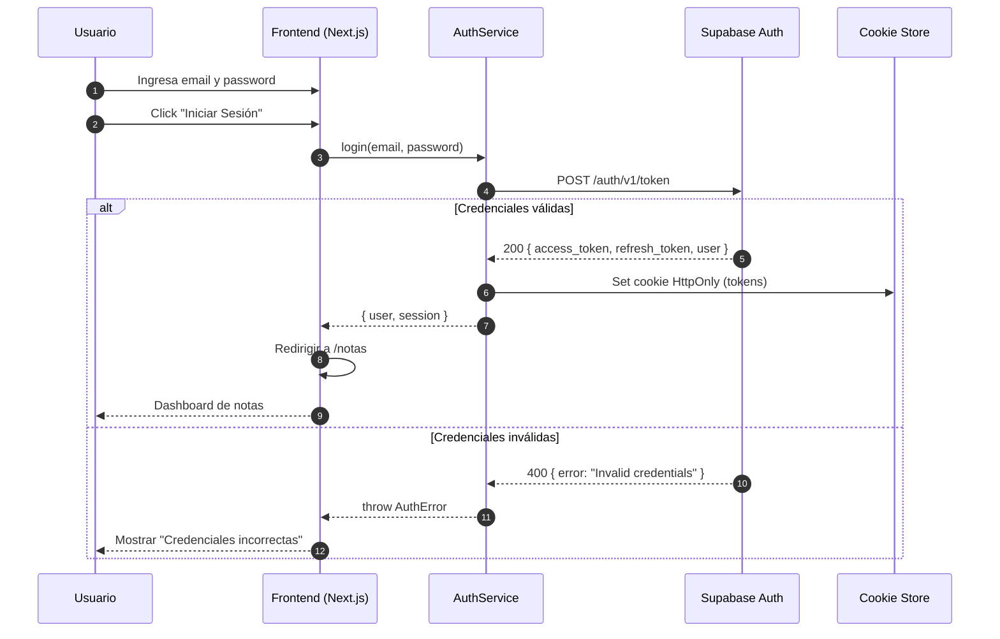
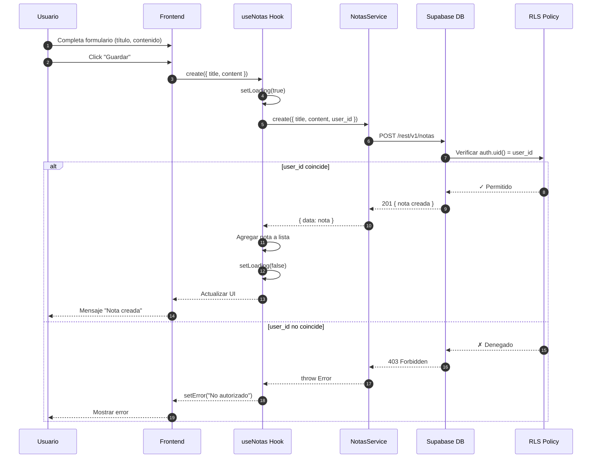
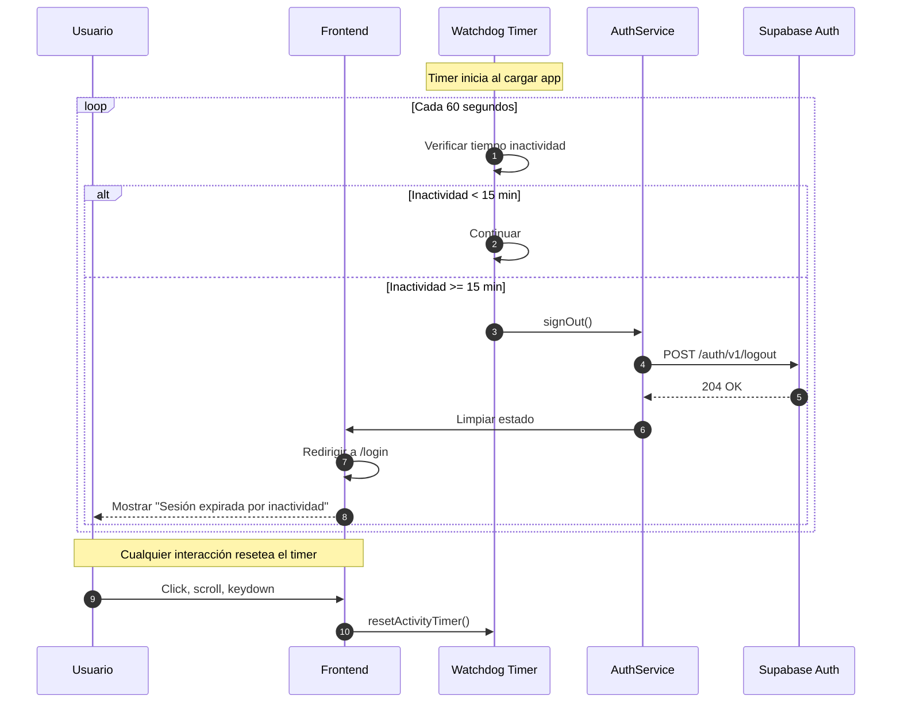

# 🔌 Fase 3-C: API y Dinámica

> **Proyecto:** CRUD Didáctico con Supabase  
> **Fecha:** 2025-12-23  
> **Referencia:** Continuación de `03_b_modelado_datos.md`

---

## 1. Mapa de Endpoints (Con Trazabilidad Total)

### 1.1 Visión General de Rutas

```
┌─────────────────────────────────────────────────────────────────────────┐
│                         MAPA DE ENDPOINTS                               │
├─────────────────────────────────────────────────────────────────────────┤
│                                                                         │
│  AUTENTICACIÓN (Supabase Auth)                                         │
│  ─────────────────────────────                                          │
│  POST   /auth/signup        → Registrar usuario                        │
│  POST   /auth/token         → Login (obtener JWT)                      │
│  POST   /auth/logout        → Cerrar sesión                            │
│  GET    /auth/user          → Obtener usuario actual                   │
│                                                                         │
│  NOTAS (Supabase Database)                                             │
│  ─────────────────────────                                              │
│  GET    /rest/v1/notas      → Listar notas del usuario                 │
│  GET    /rest/v1/notas?id=eq.{id} → Obtener nota por ID                │
│  POST   /rest/v1/notas      → Crear nueva nota                         │
│  PATCH  /rest/v1/notas?id=eq.{id} → Actualizar nota                    │
│  DELETE /rest/v1/notas?id=eq.{id} → Eliminar nota                      │
│                                                                         │
└─────────────────────────────────────────────────────────────────────────┘

Nota: Supabase expone su API REST automáticamente.
      Las rutas reales usan el formato de PostgREST.
```

---

### 1.2 Endpoint: Registro de Usuario

| Atributo | Valor |
|----------|-------|
| **Método** | `POST` |
| **Ruta** | `/auth/v1/signup` |
| **Módulo** | AUTH |
| **Historia de Usuario** | HU-01: Registro de Usuario |
| **Caso de Uso** | CU-01: Gestionar Autenticación (Escenario: Registro) |

#### Criterios de Aceptación Trazados

| CA | Descripción | Validación API |
|----|-------------|----------------|
| CA-01.1 | Email válido y password ≥ 6 chars | 400 si inválido |
| CA-01.2 | Email no duplicado | 422 si existe |
| CA-01.3 | Registro exitoso | 200 + user object |

#### Request/Response

```
REQUEST:
POST /auth/v1/signup
Headers:
  apikey: {SUPABASE_ANON_KEY}
  Content-Type: application/json
Body:
{
  "email": "usuario@ejemplo.com",
  "password": "password123"
}

RESPONSE (201 Created):
{
  "id": "uuid-del-usuario",
  "email": "usuario@ejemplo.com",
  "created_at": "2025-12-23T22:00:00Z"
}

ERRORES:
- 400 Bad Request: { "error": "Password should be at least 6 characters" }
- 422 Unprocessable: { "error": "User already registered" }
```

---

### 1.3 Endpoint: Login

| Atributo | Valor |
|----------|-------|
| **Método** | `POST` |
| **Ruta** | `/auth/v1/token?grant_type=password` |
| **Módulo** | AUTH |
| **Historia de Usuario** | HU-02: Inicio de Sesión |
| **Caso de Uso** | CU-01: Gestionar Autenticación (Escenario: Login) |

#### Criterios de Aceptación Trazados

| CA | Descripción | Validación API |
|----|-------------|----------------|
| CA-02.1 | Credenciales correctas | 200 + tokens |
| CA-02.2 | Credenciales incorrectas | 400 (mensaje genérico) |
| CA-02.3 | Sesión persistente | Token en cookie HttpOnly |

#### Request/Response

```
REQUEST:
POST /auth/v1/token?grant_type=password
Headers:
  apikey: {SUPABASE_ANON_KEY}
  Content-Type: application/json
Body:
{
  "email": "usuario@ejemplo.com",
  "password": "password123"
}

RESPONSE (200 OK):
{
  "access_token": "eyJhbGciOiJIUzI1...",
  "refresh_token": "v3_refresh_token...",
  "expires_in": 900,  // 15 minutos
  "token_type": "bearer",
  "user": {
    "id": "uuid",
    "email": "usuario@ejemplo.com"
  }
}

ERRORES:
- 400 Bad Request: { "error": "Invalid login credentials" }
```

---

### 1.4 Endpoint: Logout

| Atributo | Valor |
|----------|-------|
| **Método** | `POST` |
| **Ruta** | `/auth/v1/logout` |
| **Módulo** | AUTH |
| **Historia de Usuario** | HU-03: Cierre de Sesión |
| **Caso de Uso** | CU-01: Gestionar Autenticación (Escenario: Logout) |

#### Criterios de Aceptación Trazados

| CA | Descripción | Validación API |
|----|-------------|----------------|
| CA-03.1 | Sesión destruida | 204 No Content |
| CA-03.2 | Cookie eliminada | Set-Cookie: vacía |

---

### 1.5 Endpoint: Listar Notas

| Atributo | Valor |
|----------|-------|
| **Método** | `GET` |
| **Ruta** | `/rest/v1/notas?select=*&order=created_at.desc` |
| **Módulo** | NOTAS |
| **Historia de Usuario** | HU-05: Listar Notas |
| **Caso de Uso** | CU-02: Gestionar Notas (Escenario: Listar) |

#### Criterios de Aceptación Trazados

| CA | Descripción | Validación API |
|----|-------------|----------------|
| CA-05.1 | Usuario con notas | 200 + array de notas |
| CA-05.2 | Usuario sin notas | 200 + array vacío |
| CA-05.3 | Solo notas propias | RLS filtra automáticamente |
| CA-05.4 | Ordenadas por fecha | `order=created_at.desc` |

#### Request/Response

```
REQUEST:
GET /rest/v1/notas?select=*&order=created_at.desc
Headers:
  apikey: {SUPABASE_ANON_KEY}
  Authorization: Bearer {ACCESS_TOKEN}

RESPONSE (200 OK):
[
  {
    "id": "uuid-1",
    "user_id": "uuid-user",
    "title": "Mi primera nota",
    "content": "Contenido...",
    "created_at": "2025-12-23T22:00:00Z",
    "updated_at": "2025-12-23T22:00:00Z"
  }
]

ERRORES:
- 401 Unauthorized: Token inválido o expirado
```

---

### 1.6 Endpoint: Crear Nota

| Atributo | Valor |
|----------|-------|
| **Método** | `POST` |
| **Ruta** | `/rest/v1/notas` |
| **Módulo** | NOTAS |
| **Historia de Usuario** | HU-04: Crear Nota |
| **Caso de Uso** | CU-02: Gestionar Notas (Escenario: Crear) |

#### Criterios de Aceptación Trazados

| CA | Descripción | Validación API |
|----|-------------|----------------|
| CA-04.1 | Título obligatorio | 400 si vacío |
| CA-04.2 | Contenido opcional | NULL permitido |
| CA-04.3 | user_id automático | RLS valida auth.uid() |
| CA-04.4 | Nota creada | 201 + nota creada |

#### Request/Response

```
REQUEST:
POST /rest/v1/notas
Headers:
  apikey: {SUPABASE_ANON_KEY}
  Authorization: Bearer {ACCESS_TOKEN}
  Content-Type: application/json
  Prefer: return=representation
Body:
{
  "title": "Nueva nota",
  "content": "Contenido opcional",
  "user_id": "uuid-del-usuario"
}

RESPONSE (201 Created):
{
  "id": "uuid-nueva-nota",
  "user_id": "uuid-user",
  "title": "Nueva nota",
  "content": "Contenido opcional",
  "created_at": "2025-12-23T22:00:00Z",
  "updated_at": "2025-12-23T22:00:00Z"
}

ERRORES:
- 400 Bad Request: Validación fallida
- 401 Unauthorized: Token inválido
- 403 Forbidden: RLS violation (user_id no coincide)
```

---

### 1.7 Endpoint: Actualizar Nota

| Atributo | Valor |
|----------|-------|
| **Método** | `PATCH` |
| **Ruta** | `/rest/v1/notas?id=eq.{id}` |
| **Módulo** | NOTAS |
| **Historia de Usuario** | HU-06: Editar Nota |
| **Caso de Uso** | CU-02: Gestionar Notas (Escenario: Editar) |

#### Criterios de Aceptación Trazados

| CA | Descripción | Validación API |
|----|-------------|----------------|
| CA-06.1 | Modificar título/contenido | 200 + nota actualizada |
| CA-06.2 | updated_at automático | Trigger en BD |
| CA-06.3 | Solo nota propia | RLS bloquea si no es owner |
| CA-06.4 | Nota no existe | 404 Not Found |

---

### 1.8 Endpoint: Eliminar Nota

| Atributo | Valor |
|----------|-------|
| **Método** | `DELETE` |
| **Ruta** | `/rest/v1/notas?id=eq.{id}` |
| **Módulo** | NOTAS |
| **Historia de Usuario** | HU-07: Eliminar Nota |
| **Caso de Uso** | CU-02: Gestionar Notas (Escenario: Eliminar) |

#### Criterios de Aceptación Trazados

| CA | Descripción | Validación API |
|----|-------------|----------------|
| CA-07.1 | Nota eliminada | 204 No Content |
| CA-07.2 | Solo nota propia | RLS bloquea |
| CA-07.3 | Nota no existe | 404 (o 204 idempotente) |

---

## 2. Diagrama de Secuencia (Mermaid)

### 2.1 Flujo de Login



### 2.2 Flujo de Crear Nota



### 2.3 Flujo de Sesión Expirada (Watchdog)



---

## 3. Seguridad de Diseño y Sesión

### 3.1 Gestión de API Keys

```
┌─────────────────────────────────────────────────────────────────────────┐
│                    GESTIÓN DE API KEYS                                  │
├─────────────────────────────────────────────────────────────────────────┤
│                                                                         │
│  SUPABASE KEYS:                                                        │
│  ──────────────                                                         │
│                                                                         │
│  1. ANON KEY (Pública)                                                 │
│     ├── Expuesta en el cliente (es seguro)                             │
│     ├── RLS determina qué puede hacer                                  │
│     └── Guardada en: NEXT_PUBLIC_SUPABASE_ANON_KEY                     │
│                                                                         │
│  2. SERVICE ROLE KEY (Secreta) 🔒                                      │
│     ├── NUNCA exponer en cliente                                       │
│     ├── Saltea RLS (acceso total)                                      │
│     ├── Solo usar en Server Actions o APIs seguras                     │
│     └── Guardada en: SUPABASE_SERVICE_ROLE_KEY (sin NEXT_PUBLIC_)      │
│                                                                         │
│  ALMACENAMIENTO:                                                       │
│  ─────────────────                                                      │
│                                                                         │
│  LOCAL:                                                                │
│  ├── .env.local (NO se sube a Git)                                     │
│  │   NEXT_PUBLIC_SUPABASE_URL=https://xxx.supabase.co                  │
│  │   NEXT_PUBLIC_SUPABASE_ANON_KEY=eyJhbGciOi...                       │
│  │   SUPABASE_SERVICE_ROLE_KEY=eyJhbGciOi... (opcional)                │
│  │                                                                      │
│  └── .env.example (SÍ se sube a Git)                                   │
│      NEXT_PUBLIC_SUPABASE_URL=tu_url_aqui                              │
│      NEXT_PUBLIC_SUPABASE_ANON_KEY=tu_anon_key_aqui                    │
│                                                                         │
│  VERCEL:                                                               │
│  └── Dashboard > Settings > Environment Variables                      │
│      (Mismas variables que .env.local)                                 │
│                                                                         │
└─────────────────────────────────────────────────────────────────────────┘
```

### 3.2 Lógica de Watchdog (15 minutos)

```
┌─────────────────────────────────────────────────────────────────────────┐
│                    LÓGICA DE WATCHDOG - INACTIVIDAD                     │
├─────────────────────────────────────────────────────────────────────────┤
│                                                                         │
│  OBJETIVO: Cerrar sesión automáticamente tras 15 min de inactividad    │
│                                                                         │
│  IMPLEMENTACIÓN (Cliente):                                             │
│  ─────────────────────────                                              │
│                                                                         │
│  1. INICIALIZACIÓN (al montar AuthProvider):                           │
│     lastActivityTime = Date.now()                                      │
│     INACTIVITY_LIMIT = 15 * 60 * 1000  // 15 minutos en ms             │
│                                                                         │
│  2. EVENTOS QUE RESETEAN EL TIMER:                                     │
│     document.addEventListener('click', resetTimer)                      │
│     document.addEventListener('keydown', resetTimer)                    │
│     document.addEventListener('scroll', resetTimer)                     │
│     document.addEventListener('mousemove', resetTimer) // opcional      │
│                                                                         │
│     function resetTimer() {                                            │
│       lastActivityTime = Date.now()                                    │
│     }                                                                   │
│                                                                         │
│  3. VERIFICACIÓN PERIÓDICA (cada 60 segundos):                         │
│     setInterval(() => {                                                │
│       const elapsed = Date.now() - lastActivityTime                    │
│       if (elapsed >= INACTIVITY_LIMIT) {                               │
│         forceLogout()                                                  │
│       }                                                                 │
│     }, 60000)                                                           │
│                                                                         │
│  4. LOGOUT FORZADO:                                                    │
│     async function forceLogout() {                                     │
│       await supabase.auth.signOut()                                    │
│       clearInterval(watchdogInterval)                                  │
│       router.push('/login?expired=inactivity')                         │
│     }                                                                   │
│                                                                         │
│  COMPLEMENTO (Token Expiration):                                       │
│  ─────────────────────────────                                          │
│  - access_token de Supabase expira en ~1 hora por defecto              │
│  - Supabase SDK hace refresh automático si hay actividad               │
│  - Si no hay actividad, el refresh NO ocurre → token expira            │
│                                                                         │
└─────────────────────────────────────────────────────────────────────────┘
```

### 3.3 Protocolo de Intercepción Frontend (401)

```
┌─────────────────────────────────────────────────────────────────────────┐
│               PROTOCOLO DE INTERCEPCIÓN - SESIÓN EXPIRADA              │
├─────────────────────────────────────────────────────────────────────────┤
│                                                                         │
│  PROBLEMA: El usuario hace una acción con token expirado               │
│                                                                         │
│  DETECCIÓN:                                                            │
│  ──────────                                                             │
│                                                                         │
│  1. EN SERVICIOS (Adapter):                                            │
│     async function getAll() {                                          │
│       const { data, error } = await supabase                           │
│         .from('notas')                                                 │
│         .select('*')                                                   │
│                                                                         │
│       if (error) {                                                     │
│         if (error.code === 'PGRST301' ||                               │
│             error.message.includes('JWT expired')) {                   │
│           throw new SessionExpiredError()                              │
│         }                                                               │
│         throw error                                                    │
│       }                                                                 │
│       return data                                                      │
│     }                                                                   │
│                                                                         │
│  2. EN HOOKS (Facade):                                                 │
│     try {                                                              │
│       const data = await notasService.getAll()                         │
│       setNotas(data)                                                   │
│     } catch (error) {                                                  │
│       if (error instanceof SessionExpiredError) {                      │
│         handleSessionExpired()  // ← Acción específica                 │
│       } else {                                                         │
│         setError(error.message)                                        │
│       }                                                                 │
│     }                                                                   │
│                                                                         │
│  3. HANDLER CENTRALIZADO:                                              │
│     function handleSessionExpired() {                                  │
│       // 1. Limpiar estado local                                       │
│       setUser(null)                                                    │
│       setNotas([])                                                     │
│                                                                         │
│       // 2. Mostrar mensaje al usuario                                 │
│       toast.warn('Tu sesión ha expirado. Por favor, inicia sesión.')   │
│                                                                         │
│       // 3. Redirigir a login                                          │
│       router.push('/login?expired=true')                               │
│     }                                                                   │
│                                                                         │
│  FLUJO VISUAL:                                                         │
│  ─────────────                                                          │
│                                                                         │
│     Usuario ──► Acción ──► API ──► 401/JWT Expired                     │
│                                        │                                │
│                              ┌─────────┴─────────┐                      │
│                              ▼                   ▼                      │
│                     Detectar error         Limpiar estado               │
│                              │                   │                      │
│                              └─────────┬─────────┘                      │
│                                        ▼                                │
│                              Mostrar toast/modal                        │
│                                        │                                │
│                                        ▼                                │
│                              Redirigir a /login                         │
│                                                                         │
└─────────────────────────────────────────────────────────────────────────┘
```

### 3.4 Tabla Resumen de Seguridad

| Aspecto | Estrategia | Ubicación |
|---------|------------|-----------|
| API Keys públicas | `NEXT_PUBLIC_*` + RLS | `.env.local` |
| API Keys secretas | Sin prefijo, solo servidor | `.env.local` |
| Sesión | JWT en cookies HttpOnly | Supabase Auth |
| Inactividad | Watchdog 15 min en cliente | `AuthContext` |
| Token expirado | Catch 401 → redirect login | Services + Hooks |
| Aislamiento datos | Row Level Security | Políticas PostgreSQL |

---

## 4. Próximos Pasos

1. ✅ **Fase 3-A:** Arquitectura y Patrones
2. ✅ **Fase 3-B:** Modelado de Datos
3. ⏳ **Fase 3-C:** API y Dinámica (este documento - en revisión)
4. 🔜 **Fase 4:** Implementación

---

> **Documento generado:** 2025-12-23  
> **Pendiente:** Aprobación de especificaciones API
